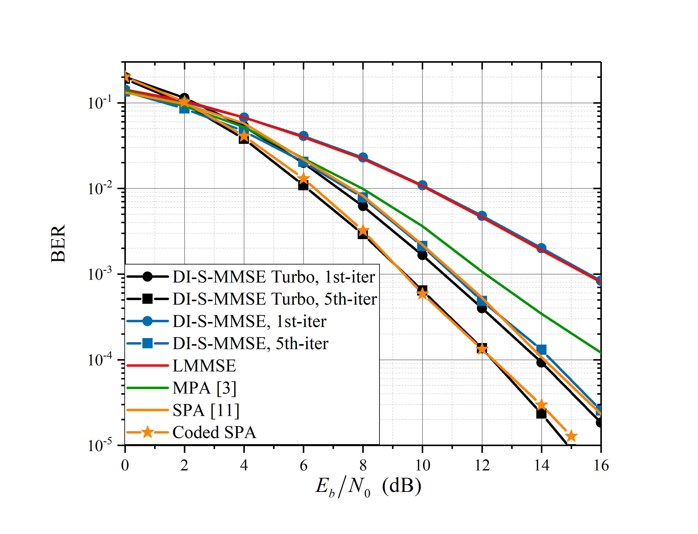

# DI-S-MMSE Turbo Equalization for OTFS Modulation

[]([https://arxiv.org/pdf/2109.07644.pdf](https://arxiv.org/abs/2207.00866))
[](https://opensource.org/licenses/MIT)



## About
This repository provides code to reproduce the results of DI-S-MMSE Turbo equalizer, which iteratively exchanges the extrinsic information between a soft-input-soft-input (SISO) MMSE estimator and a SISO decoder. Simulation results demonstrate that our proposed equalizer not only approaches the BER performance of the near-optimal symbol-wise MAP algorithm, but also has a linear complexity.  

Details of this work can be found on [IEEE](https://ieeexplore.ieee.org/document/10018250) or [arKiv](https://arxiv.org/abs/2207.00866).

## Citation
If you find this code useful for your research or use it in your work, please consider citing:
```
@article{li2023doubly,
  title={Doubly-Iterative Sparsified MMSE Turbo Equalization for OTFS Modulation},
  author={Li, Haotian and Yu, Qiyue},
  journal={IEEE Transactions on Communications},
  volume={71},
  number={3},
  pages={1336--1351},
  year={2023},
  publisher={IEEE}
}
``` 

## Instructions
Our code is developed and tested on MATLAB 2019a.

**Simulation Settings**
- *DI-S-MMSE equalizer*: (i.e., without decoder) execute `DI_S_MMSE.m`  with your preferred parameters.
- *DI-S-MMSE turbo equalizer*: run `DI_S_MMSE_Turbo.m`  with your preferred parameters.
- *LMMSE equalizer*: execute  `DI_S_MMSE.m` and set `iterTimes=1`. This is because the first turbo iteration of *DI-S-MMSE equalizer* is equivalent to the *LMMSE equalizer*.

**Speedup Trick**

If your computer has multiple cores, you can utilize the "**parfor**" loops to execute this code in parallel on workers, which can significantly speed up the calculations. Specifically, you can replace the line "for sim = 1:sumSim" with "parfor sim = 1:sumSim" in both `DI_S_MMSE.m` and `DI_S_MMSE_Turbo.m`. 

However, please note that when using the "parfor" loop, you will also need to comment out the display code at the end of the loop.  

## Contact
Should you have any questions or find any errors, please do not hesitate to let me know:{htianli503@gmail.com}
